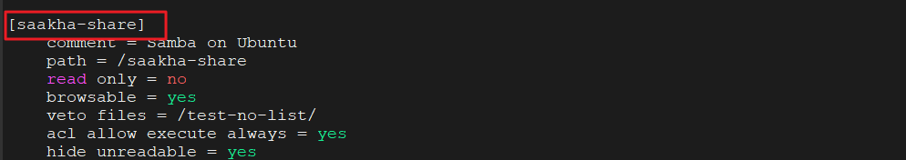

## TAsk 1:  samba server setup garna ko lagi

### step -1 : samba package install garna lai
```
sudo apt update
sudo apt install samba

# folder aafno choice ko select garnu
sudo mkdir /sambashare/

```
### step -2 : confoguration milauna
```
sudo nano /etc/samba/smb.conf
```


```config
[samba-share]
    comment = Samba on Ubuntu
    path = /samba-share
    read only = no
    browsable = yes
    veto files = /test-no-list/
    acl allow execute always = yes
    hide unreadable = yes

```
## NOTE: yo wala hatauda hunxa if permission na bhako pani liste garnu xa bhane
```
hide unreadable = yes
```
### step -3 service restart garear change apply garna
```
 sudo systemctl restart smbd.service
 sudo systemctl restart nmbd.service
```


## TAsk -2 : Manual User setup  garna lai

### step1 : group banauna
```
sudo groupadd ktm_team
```
### step2 : user banauna ra group direct halna
```
sudo useradd -m -G ktm_team ktm_team_user
```
### step 3 : samba server ma password halna file sharing ko lagi
```
sudo smbpasswd -a ktm_team_user
```
#### step -4 : samba ko folder banauna
```
sudo mkdir /samba-share/ktm_team_folder
```
#### step -5 : samba ko bahek aru user ko permissiom hatauna
```
sudo chown :ktm_team /samba-share/ktm_team_folder
sudo chmod 750 /samba-share/ktm_team_folder
```

#### Note : /samba-share/ktm_team_folder ko thau ma /samba-share/ktm_team rakhnu
#### bujhna lai yesto rakheko


## 3: automatic setup

```
cd samba-setup

# purai user reset garera setup ko lagi (purano user ko password reset na gari)
chmod +x samba-user-safe.sh
./samba-user-safe.sh


# purai user reset garera setup ko lagi (first setup or password leak case)
chmod +x samba-user-reset.sh
./samba-user-reset.sh

# thorai user xahiyeko bela add garna
chmod +x samba-user-reset.sh
./samba-setup.sh -g subash

# 1 bhanda  badhi user xa bhane
./samba-setup.sh -g subash1,subash2,subash3

```


## cleint bata check garna (OPTIONAL) + troubleshoot garna
### linux ko lagi install client garna 
```
sudo apt install 
sudo apt install samba-client
```
# NOTE
## `Task 1 ko step2 : ma j [sambashare] ko thau ma j bha xa tei use garnu]` 

for e.g

connection check garna
```
smbclient //192.168.253.128/sambashare -U subash
### password sodhxa halne

## password reset garna (birseko xa bhane)
sudo smbpasswd -a ktm_team_user

```

### windows ko lagi
```
win +r => run open hnxa

\\192.168.253.128\sambashare

```

### windows ko connection reset garna
##### windows ko `cmd` kholera line by line
```
net use
net use * /d
klist purge
```